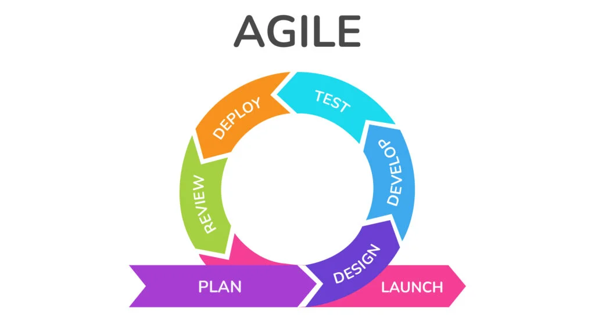
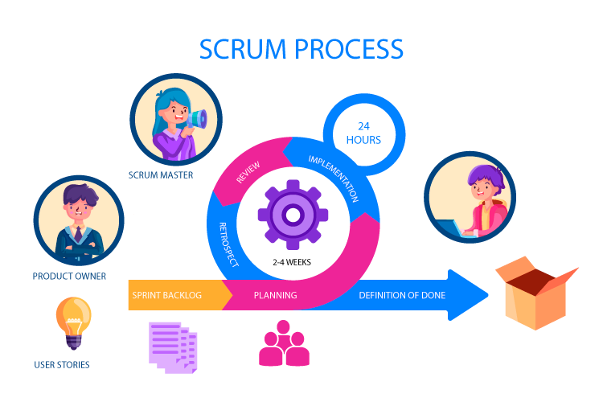

## Que es exito?
Cumplir con tiempo, presupuesto, calidad y expectativas del cliente

## Caracteristicas de proyectos de TI exitosos
- Cumplimiento de plazos y presupuesto
- Alta satisfaccion del cliente
- Producto de calidad
- Comunicacion efectiva
- Adaptabilidad a cambios 
- Buena gestion del riesgo (anticipacion y mitigacion)
- Valor tangible para el negocio

### Ejemplos de proyectos de TI exitosos
- AWS (plataforma en la nube escalable y adaptable)
- Netflix (plataforma de streaming automatico para ofrecer recomendaciones personalizadas)
- Starbucks (App movil para pedidos y pagos con programa de lealtad)

## Factores que influyen en el fracaso de proyectos de TI
- Definicion del Proyecto de TI
- Importancia de los proyectos
- Fracasos en la gestion de proyectos

### Algunos Factores
- Falta de planificacion adecuada
- Cambios en el alcance 
- Falta de liderazdo
- Falta de recursos
- Tecnologia inadecuada o desactualizada
- Mala gestion de riesgos
- Expectativas no realistas
- Resistencia al cambio 
- Fallos en la integracion y pruebas

### Consejos para evitar el fracaso
- Mejorar la planificacion y la comunicacion
- Definir claramente los requisitos y mantener el alcance bajo control
- Asegurarse de contar con personal capacitado y herramientas adecuadas
- Realizar pruebas exhaustivas y gestion activa de riesgos
- Gestionar las expectativas y establecer plazos realistas

## Herramientas de proyectos de TI
Sistemas de Gestion de Proyectos (Project Management)

Estas herramientas permiten planificar, asignar tareas y hacer seguimiento al progreso del proyecto.

### Ejemplos
- Jira
- Trello
- Microsoft Project

### Ventajas
- Facilitan la asignacion de tareas y el seguimiento del progreso
- Mejoran la visibilidad del estado del proyecto para todos los miembros del equipo
- Permiten una mejora en la comunicacion y colaboracion entre los miembros del equipo
- Ayudan a identificar y gestionar los riesgos del proyecto

### Desventajas
- Pueden ser costosas
- Requieren tiempo y esfuerzo para aprender a utilizarlas correctamente
- Pueden ser dificiles de personalizar para adaptarse a las necesidades especificas de cada proyecto
- Pueden no ser adecuadas para proyectos pequenos o equipos reducidos

### Herramientas de control de versiones
- Git
- SVN
- Bitbucket

### Herramientas de Integracion y Entrega Continua (CI/CD)
Plataformas que automatizan 

#### Ejemplos
- Jenkins
- CircleCI
- GitLab CI/CD

### Herramientas de colaboracion y comunicacion
Son esenciales para mejorar la comunicacion entre los miembros del equipo, 

#### Ejemplos
- Slack
- Microsoft Teams
- Zoom

## Describir las metodologias de desarrollo de proyectos de TI | (Scrum y Agile)

### Que es la metodologia AGIL
- Nacio en 2001, su meta es la colaboracion.

### Que es SCRUM
1. Reconocimiento: Individuos e interacciones sobre procesos y herramientas
2. Analisis: Software funcionando sobre documentacion extensa
3. Planeacion: Colaboracion con el cliente sobre negociacion de contratos
4. Ejecucion: Respuesta ante el cambio de seguir un plan
