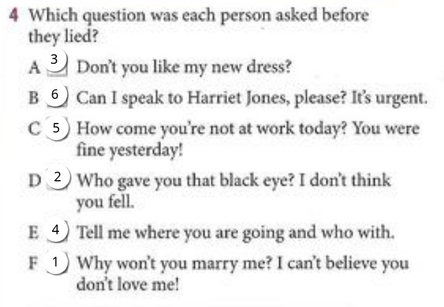
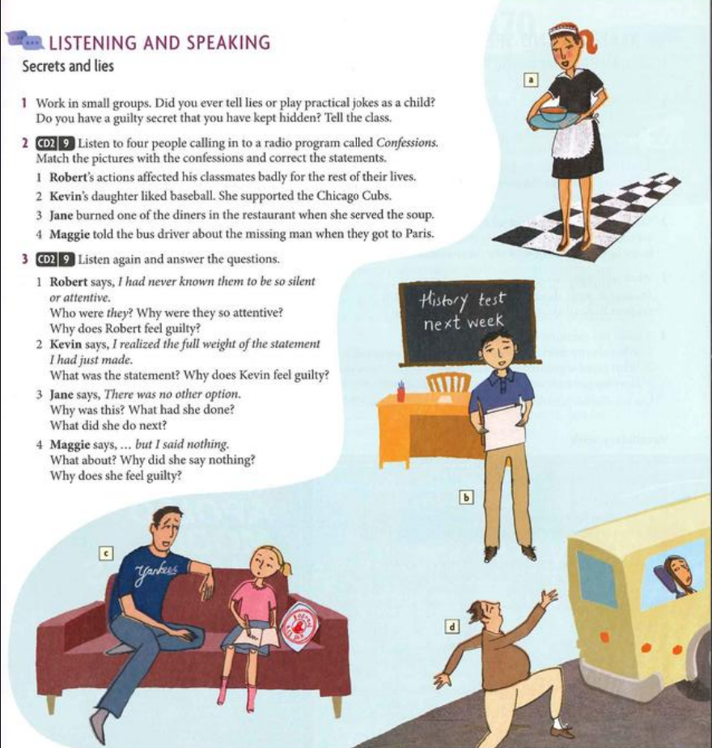

# News and views

## Can you believe it?
1. **What is the story about?**
The story is about a Swedish man named Peter Skyllberg who survived 60 days trapped in his car in the snow, eating only handfuls of snow to stay hydrated.

2. **What additional information are you curious about?**

   * **Who discovered him?**
     He was discovered by a passerby on a snowmobile while they were clearing the roadway.

   * **Where was he stuck?**
     He was stuck on a secluded forest road in northern Sweden.

   * **How did he manage to survive?**
     He managed to survive by consuming snow for hydration and trying to stay warm in a sleeping bag.

   * **When did they find him?**
     He was located on a Friday, 60 days after he became trapped.

   * **What did he use to keep warm?**
     At first, he relied on the warmth from his car’s engine until the fuel was exhausted, and then he depended on his sleeping bag.

   * **Why are some experts doubtful?**
     Some experts are doubtful because it’s uncommon for someone to survive 60 days without food, and they wonder if he might have gone into a state resembling hibernation.

3. **Are you able to get answers to all your inquiries? What are your thoughts on why certain experts have doubts?**

Yes, the article answers most inquiries regarding who discovered him, where he was trapped, and how he survived. Some experts have doubts because it’s unusual for a person to endure such severe conditions without food for an extended period, and the notion of human hibernation seems far-fetched to them.

5. Listen to two people discussing the article. Complete the lines from their conversation
  1. Does he was buried by an avalanche while he was sking?
  2. No, he hadnt been skiing
  3. He was driving his car and he got stuck in snowdrifts
  4. Ho come nobody found him?
  5. He had brought a sleeping bag and he was lying in that
  6. Why didnt anyone report him missing?
  7. He said he had eaten nothingg but snow
  8. I think theres more to this story than meets the eye

## Excerise 6
1. Do u think its possible to live so long with only snow to eat?
   1. No, at least ur fat or superman

## practice 2

1. Joel was tired when he arrived home after getting up at dawn and driving for ten hours.

2. When I went to get my car, it wasn’t there because I had parked it in a no-parking zone, and it was towed away.

3. Last night Sally was celebrating because she had won $2,000 in a competition.

4. When Jane and Loyd arrived home, they were broke because they had been shopping all day and spent all their money on clothes.

5. Last week John moved into the house he had first seen while driving around on vacation.

## Act pag 21

1. Who wrote it?
2. What genre is it?
3. What is it about?
4. Where and when is it set?
5. Who are the main characters?
6. Has it been made into a movie?
7. How does it end?
8. Did you enjoy it?
9. What did the critics say about it?
10. Has it won any awards?

## Writing
The Little Prince is this cool book written by Antoine something (i do not remember his last name), a French author, back in 1943. It’s about this little prince who travels to different planets and meets all sorts of strange characters. Each person he meets teaches him something, and the whole story is full of deep stuff about life, love, and growing up.

The story starts with a pilot who crashes his plane in the desert and meets the little prince. The prince asks him to draw a sheep, and that’s how they start chatting. The prince tells the pilot about his journey and the people he’s met, like a king, a vain dude, a drunk guy, a lamplighter, and a geographer. Each of them kind of represents different parts of society, and the book pokes fun at how adults often care too much about stuff like power and appearances.

One of the best parts of The Little Prince is when the prince says, "What is essential is invisible to the eye." Basically, it’s a reminder that the most important things in life just like love, friendship, and real connections are not things you can see or touch. The prince learns this with his rose, realizing she is special, even though she looks like any other rose.

Even though the book seems like it’s for kids, it’s actually got a lot of deep stuff for anyone. It’s all about remembering what really matters in life—love, real connections, and seeing the world through the eyes of a child.

## Act listening
1. Why is lucy surprised about rachels change of opinion?  
   1. Bc rachel was against use a screen to read

2. What benefits to the Kindle do they talk about? And what limitations?
   1. Reading in bed, but not when the battery is dead
   2. Can not read at the same time when theres sun
   3. Kindle is cheaper

3. Why isn't Lucy as eager as Rachel to switch to using a Kindle?
   1. Bc rachels said that she liked to flip pages, and not to use a screen
   2. Rachel was the first person that introduce Lucy to physical books

## Other listening
1. What development in movie-making has Eddie found out about?
   1. That you can download movies from the internet
2. What are the pros and cons of going to the movie theater? And of downloading/streaming video?
---
   1. Pros: Big screen, all people feels the same thing, color, sound.
   2. Cons: Expensive, noisy, and you can not pause.
---
   1. Pros: You can pause, cheaper, and you can watch it in your house.
   2. Cons: Small screen, not the same experience, and you can not share with other people.
1. Why doesn't Greg like the same type of movies as his girlfriend?
   1. Bc of the subtitles and being black and white foreign films
2. How does Eddie offer to help Greg?
   1. Giving them some DVDs

# act
Here is the solution in English:

1. Complete the missing word in each question:
   What kind of music do you like? "Jazz."
   How often do you wash your hair? "Every other day."
   Who do you look like? "My mother."
   What were you talking to the teacher about? "Oh, this and that."
   Do you know what time it is? "A little after three."
   
2. Make the sentences negative (there may be more than one possibility):
   I don’t agree with you.
   I don’t think you’re right.
   I didn’t tell her to go home.
   I didn’t know everybody at the party.
   I haven’t done my homework yet.
   My sister doesn’t like jazz either.

## act 
think of some lies that these people might tell
1. a teenage girl to her parent
   1. i didnt kill him
2. a car salesperson
   1. this is the best car everknown
3. a student to the teacher
   1. it was the alien that enter into my house and kill my fathers
4. a politician
   1. ill make it for all of u
5. a husband to his wife 
   1. i love u

## 3. Listen to what the people are really thinking. What is the truth? Why did they lie?
1. She doesnt love him. She doesnt want to hurt him
2. he's afraid idk
3. she's just jealous i think
4. she dont want his father to know about a party
5. he just want to play golf
6. she just doesnt care about 

### 4. Which question was each person asked 

### 2. Read and listen to two short convesations. Which 
1. A - Surprise
   B - Information
2. A - Information 
   B - Surprise

### 3. Work in pairs. Asl and answer about these things using negative questions
- Im surprised
  - _like/ice cream_
    - Dont u like ice cream?
  - _have/a smartphone_
    - Dont u have a smartphone
  - _can/swim_
    - Cant u swim?
- im just cheking
  - _is/birthday today_
    - Isn't ur birthday today?
  - _work/New York for a while_
    - Haven’t u worked in New York for a while?
  - _live/on Baker St._
    - Don’t u live on Baker St.?

### Act 4. Make a negative sentence about these people. Use you dictonary
- vegetarian
  - vegetarians dont eat meat
- atheists
  - atheist dont belive in God
- insomniacs
  - insomniacs cant sleep at night 
- dyslexics
  - dyslexics r not just stupid u know
- pacifists
  - pacifists dont support war
- naturist
  - naturist dont like to use clothes

## Act 7. We can respond to a statement with a short question to ask for more information
Write short questions with a preposition to respond to these statements 
1. She gave away all her money
   1. Who 
   2. ask u
2. Can i have a word with you, please?
   1. what about?
3. i danced all night
   1. who With?
4. Do you think you could give me a ride?
   1. Where to?
5. I got a nice present today
   1. who from?
6. I bought a birthday card today
   1. Who from?
7. Shh! Im thinking!
   1. what about?
8. I need $5000 desperately
   1. good for u, i mean, what for?

## Listen to four people calling in to a radio program called confessions. Match the pictures with the confessions and correct the statements

- b, 1. Roberts actions didnt affected his classmates badly for the rest of their lives
- c, 2. Kevins daugther liked baseball. She supported the Yankee
- a, 3. Jane burned her mouth tasting the diners in the restaraunt when she served the soup
- d, 4. Maggie didnt tell the bus driver about the missing man when they got to Paris

## Listen again and answer the questions
1. Robert says, i had never known them to be so silent or attent 
   1. Who where they? Why were they so attentive?
      1. Students, and they were atteting listening to the aswers of the exam
   2. Why does robert feel guilty?
      1. Bc he stole the exam
2. Kebin says, I realized the full weight od the statement i had just made.
   1. What was the statement? Why does kevin feel guilty?
      1. Bc he said that santa didnt like yankees kids
3. Jane says, There was no other option 
   1. Why was this? What had she done?
      1. bc she steal some soup 
   2. What did she do next?
      1. Burn his mouth
4. Maggie says... but I said nothing
   1. What about? Why did she say nothing?
      1. bc there was a smelling guy
   2. Why does she feel guilty?
      1. bc she act rude 

## act
Word | Antonym(s)
--- | ---
fake (adj) | genuine, real, authentic
like (verb) | dislike, hate, loathe, cant stand
tiny (adj) | huge, enormous, gigantic
happiness (noun) | sadness, misery, unhappiness
guilty (adj) | innocent, blameless, not guilty
safe (adj) | dangerous, risky, unsafe
admit (verb) | deny, refuse, reject
improve (verb) | worsen, decline, deteriorate
sincere (adj) | insincere, dishonest, fake
success (noun) | failure, defeat, disaster
mature (adj) | immature, childish, juvenile
encourage (verb) | discourage, dishearten, demotivate
kind/generous (adj) | unkind, mean, selfish
appear (verb) | disappear, vanish, fade

### another act
words:
- improve
- safety
- success
- criticize
- generosity
- fail
- stingy
- encourage
- get worse 
- danger

1.  
**A:** Gary's a really **unsuccessful** businessman.  
**B:** Well, he's a complete **success** as a father. He never sees his kids.  

2.  
**A:** My grandpa’s so **stingy**, he gives me $20 every time I see him.  
**B:** You’re lucky! My grandpa is famous for his **generosity**.  
I’m happy if he gives me $5 for my birthday, if he even remembers.  

3.  
**A:** Well, Henry, I’m pleased there’s been some **improvement** in your behavior this semester, but unfortunately your work has **worsened**.  
**B:** I guess I didn’t do well on the test, then.  

4.  
**A:** You’re not going bungee jumping! It sounds really **safe**.  
**B:** No, honestly, it’s perfectly **dangerous** as long as you’re careful.  

5.  
**A:** Our teacher is always **encouraging** us. I feel useless.  
**B:** I know. He should give us more **criticism** if he wants us to work hard.  