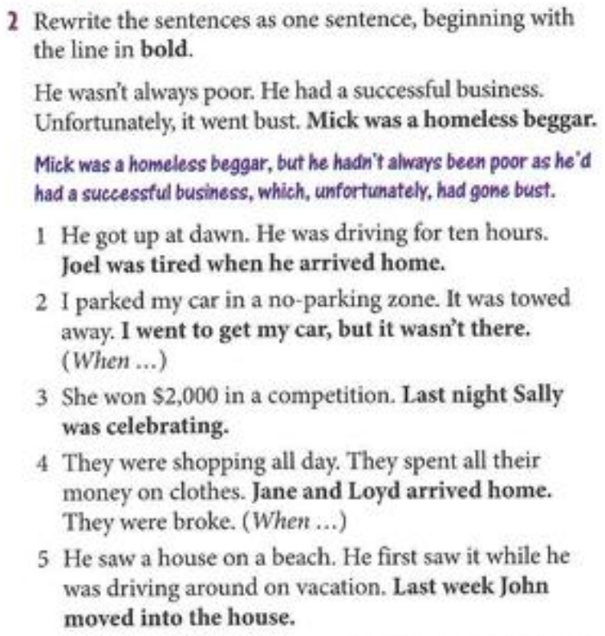

# News and views

## Can you believe it?
1. **What is the story about?**
The story is about a Swedish man named Peter Skyllberg who survived 60 days trapped in his car in the snow, eating only handfuls of snow to stay hydrated.

2. **What additional information are you curious about?**

   * **Who discovered him?**
     He was discovered by a passerby on a snowmobile while they were clearing the roadway.

   * **Where was he stuck?**
     He was stuck on a secluded forest road in northern Sweden.

   * **How did he manage to survive?**
     He managed to survive by consuming snow for hydration and trying to stay warm in a sleeping bag.

   * **When did they find him?**
     He was located on a Friday, 60 days after he became trapped.

   * **What did he use to keep warm?**
     At first, he relied on the warmth from his car’s engine until the fuel was exhausted, and then he depended on his sleeping bag.

   * **Why are some experts doubtful?**
     Some experts are doubtful because it’s uncommon for someone to survive 60 days without food, and they wonder if he might have gone into a state resembling hibernation.

3. **Are you able to get answers to all your inquiries? What are your thoughts on why certain experts have doubts?**

Yes, the article answers most inquiries regarding who discovered him, where he was trapped, and how he survived. Some experts have doubts because it’s unusual for a person to endure such severe conditions without food for an extended period, and the notion of human hibernation seems far-fetched to them.

5. Listen to two people discussing the article. Complete the lines from their conversation
  1. Does he was vurried by an avalanche while he was sking?
  2. No, he hadnt been skiing
  3. He was driving his car and he got stuck in snowdrifts
  4. Ho come nobody found him?
  5. He had brought a sleeping bag and he was lying in that
  6. Why didnt anyone report him missing?
  7. He said he had eaten nothingg but snow
  8. I think theres more to this story than meets the eye

## Excerise 6
1. Do u think its possible to live so long with only snow to eat?
   1. No, at least ur fat or superman

## practice 2

1. Joel was tired when he arrived home after getting up at dawn and driving for ten hours.

2. When I went to get my car, it wasn’t there because I had parked it in a no-parking zone, and it was towed away.

3. Last night Sally was celebrating because she had won $2,000 in a competition.

4. When Jane and Loyd arrived home, they were broke because they had been shopping all day and spent all their money on clothes.

5. Last week John moved into the house he had first seen while driving around on vacation.

## Act pag 21

1. Who wrote it?
2. What genre is it?
3. What is it about?
4. Where and when is it set?
5. Who are the main characters?
6. Has it been made into a movie?
7. How does it end?
8. Did you enjoy it?
9. What did the critics say about it?
10. Has it won any awards?