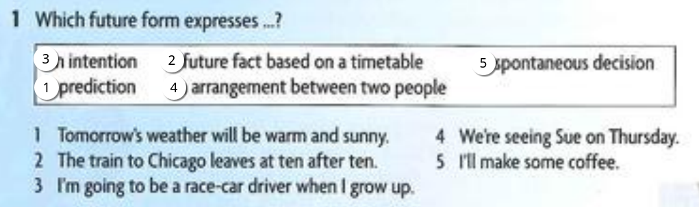

## Act 1

Name the different future forms.
1. *"Will" + base verb*: Used for predictions, promises, offers, or spontaneous decisions.
    Example: It will rain tomorrow.
2. *"Going to" + base verb*: Used for intentions or plans, and predictions based on evidence.
    Example: I’m going to study law next year.
3. *Present continuous*: Used for definite arrangements in the near future.
    Example: We’re meeting at 6 p.m.
4. *Present simple*: Used for schedules, timetables, or fixed events.
    Example: The plane departs at 8:00 a.m.

---

1. laura
2. mickey
3. tony and marie
4. elsie
5. janine
6. theo

**Answer the questions**

1. *What is Laura going to study? When do the classes start?*  
   - She's going to study psychology. They start in August.

2. *What is Mickey doing tomorrow? What time does the game start?*  
   - He's going to a soccer game. The game starts at 4:00.

3. *Why are Tony and Marie excited?*  
   - Because they're going to have a baby.

4. *What’s Elsie doing tomorrow? What will they do together?*  
   - Her daughter and grandchildren will be visiting so she'll be doing a cake
     They’ll eat cake and chat.

5. *Why is Janine packing? How’s she getting to the airport?*  
   - Because she’s going to Australia for six months.  
     Her mother and father are taking her.

6. *What are Theo’s ambitions?*  
   - In the next few years, he’s going to be more successful and will be earning more money.  
     He’ll have made a million dollars before he’s 25.

---

**Here are som answers. What are the questions? Ask and aswer with a partner.**

1. Boston University (Which...?)
   1. Which university is Laura going to study at?
   2. Boston University.
2. Hiss friends. The Red Bulls and the galaxy
   1. Who is Mickey going to the game with?
   2. His friends. The Red Bulls and the Galaxy.
3. Max or leah
   1. Who are Tony and Marie going to have a baby with?
   2. Max or Leah.
4. A strawberry cake
   1. What is Elsie going to make?
   2. A strawberry cake.
5. It leaves at 8:00
   1. What time does Janine’s flight leave?
   2. It leaves at 8:00.
6. Twice what he's earning now
   1. How much money is Theo going to be earning in a few years?
   2. Twice what he's earning now.

---

## Practice: Discussing grammar

1. I'm very excited. I'm going to see all of my family this weekend.
I don't know if I have time to come this evening. I'll see.
2. So you're off to India for a year! What are you going to do there?
I'm sure you will pass your exams, but what will you do if you don't?
3. I'll come with you if you like.
I'm coming with you whether you like it or not. 
4. Your first-quarter grades are terrible. What are you going to do about them?
What are you doing this evening?
5. I've had enough of her lazy attitude. I'm going to give her a good talking to.
I'm giving a presentation at 3:00 this afternoon. I'm scared stiff.
6. John! Peter is leaving now. Come and say goodbye.
The bus leaves at 9:00, so don't be late.
7. I'll see you outside the movie theater at 8:00. I'll be seeing Johnny this 
afternoon, so I'll tell him your news.
8. You'll have seen enough of me by the end of
this vacation. I.'m going to make a success of my life. You'll
see.

## act 2

Good afternoon ladies and gentlemen.

Welcome aboard this Virgin Atlantic flight to Boston. In a short time we **will take off** (take off). When we **reach** (reach) our cruising speed of 575 miles per hour, we **will be flying** (fly) at 37,000 feet. Our flight time today is six and a half hours. We **will come** (come) in over Newfoundland before heading down the coast to Boston. We **will arrive** (arrive) in Boston at about 5:45 US time. The cabin crew **will serve** (serve) an evening meal during the flight. If you **need** (need) any assistance, just press the call button and a flight attendant **will come** (come) to help you. In case of turbulence, **will you please keep** (keep) your seat belt fastened when you're in your seat.

(Near the end of flight)

In a few moments the cabin crew **will come** (come) around with duty-free shopping. They **will also give out** (give out) landing cards for those who **need** (need) them. In twenty minutes we **will start** (start) our descent into Boston's Logan International Airport, where the temperature is a chilly 37°F – and for the folks from the UK on board that's 3°C – with a chance of snow. Please put your seats in the upright position and remain seated until the plane **comes** (come) to a complete standstill. We hope you **will fly** (fly) again soon with Virgin Atlantic.

## act 3

1. Where **are you going** on vacation this year?
2. How **are you getting** there?
3. How long **are you going to be** away for?
4. Which hotel **are you staying** in?
5. What time **does your flight arrive**?
6. What **are you going to do** while you're on vacation?

## Activity

## Ejercicio 2: Completar la tabla
### Take
- sth for granted  
- the pressure off  
- a risk  
- part  
- advice  
- notice  
- my advice
- place
- offense
- criticism
- no notice
- forever

### Put
- my arm around  
- pressure on  
- my advice into practice  
- somebody in charge of
- a plan into practice
- pressure on sb
- sth in its place  
- his work first
- criticism  
- forever  

---

## Ejercicio 3: Completar las oraciones
1. *took place* - The wedding *took place* in an old country church. It was beautiful, it was miles away **it took forever** to get there
2. *takes after* - My son always hanging at the mall. but ill **take after** his mother, he's always on the phone.
3. *put your feet up* - Please go and *put your feet up*; I don’t think your work has been appreciated.
4. *take your time* - If you really want to make a good job of this, you’ll need to *take your time*.
5. *put off* - My boss is trying to *put off* the decision, but I won’t go.
6. *put them to bed* - Children never say “Thank you” or “How are you?” to their parents. They just *put them to bed*.

---

## Ejercicio 4: Phrasal verbs
1. *take off* - The secretary’s holiday *takes off* a lot of extra work for me.
2. *put across* - The lecture was too complicated, and the message couldn’t be *put across*.
3. *put down* - My business collapsed when banks *put down* all new loans.
4. *put in* - He called me a liar but not before he *put in* an official complaint.
5. *put up* - It’s very late now; why don’t you *put up* with us tonight?

---

## Ejercicio 5: Emparejar las líneas y subrayar expresiones
1. *Take your time* - Relax and do it carefully.
2. *Take part* - Join the activities.
3. *Put your arm around* - Offer support.
4. *Take your advice* - Follow someone’s suggestion.
5. *Put criticism into practice* - Learn from feedback.
6. *Put forever into the past* - Let go of the bad memories.