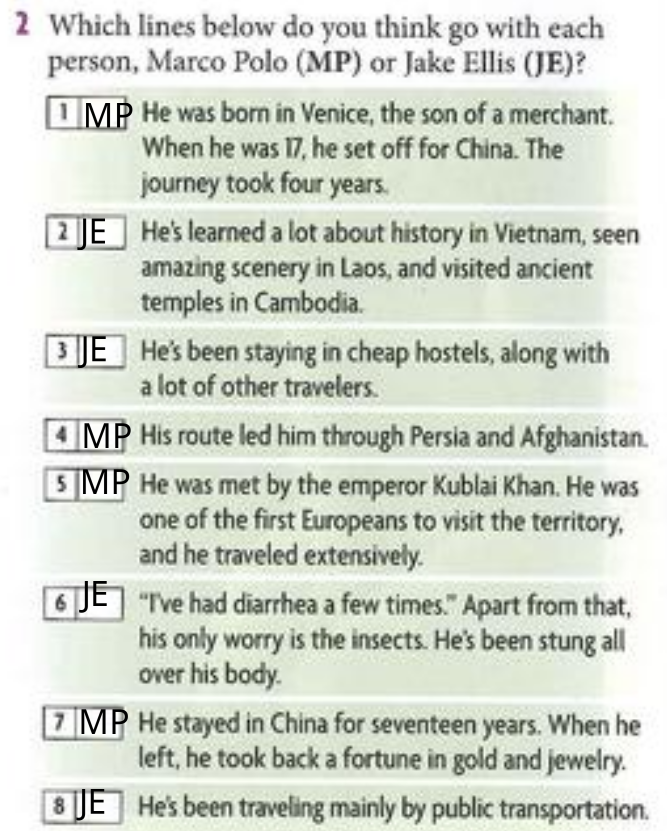
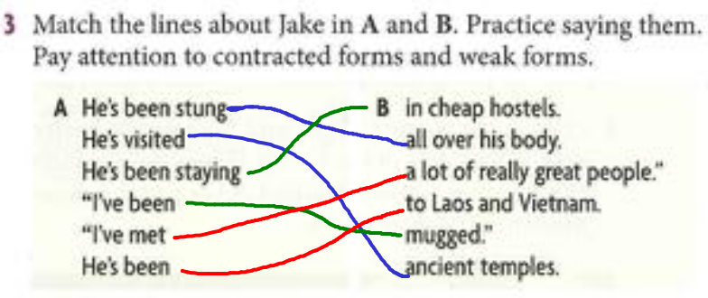
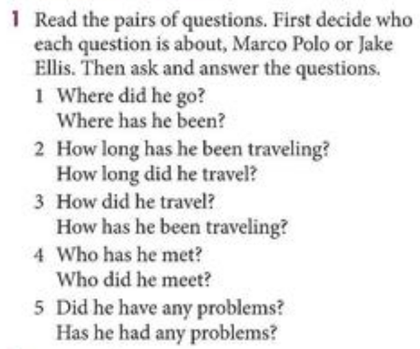
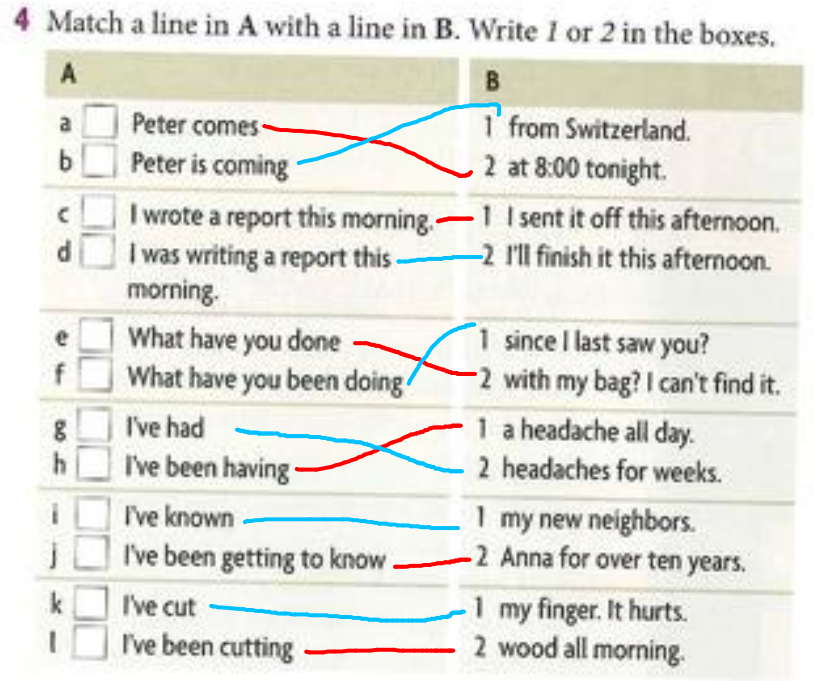

1. Work in pairs. What is strange about these sentences? What should they be?
   1. **"Columbus has discovered America"**  
      - "Columbus **discovered** America."
   
   2. **"I traveled all my life. I went everywhere"**  
      - "i **have traveled** all my life. I **have been** everywhere."
   
   3. **"I've learned English"**  
      - "i **learned** English" or "I've **been learning** English"
   
   4. **"Ouch, I've been cutting my thumb"** 
      - "ouch, I **cut** my thumb."

2. Which of these verb forms can change from simple to continuous? What is the change in meaning?
   
   1. **"What do you do on the weekend?"**  
      - "What **are you doing** on the weekend?"
   
   2. **"I don't like her boyfriend"**  
      - Is grammatically incorrect because verbs like "like" are stative and don't usually take the continuous form.
   
   3. **"I took a shower at 7:00"**  
      - "I **was taking** a shower at 7:00."  
   
   4. **"Someone's eaten my sandwich"**  
      - "Someone's **been eating** my sandwich."

## Act 2

## Act 3

## Act 4

1. Where did he go?
   1. Silk route
2. Where has he been?
   1. Bangkok and a lot of places
---
3. How logn has he been traveling
   1. 9 Months
4. How logn did he traveled?
   1. 8000 km
---
5. How did he traveled?
   1. In boat
6. How has he been traveling?
   1. On Bicycle and oublic transportation
---
7. Who has he met?
   1. Fantastic people
8. Who did he met?
   1. The emperaror Kublai Khan
---
1.  Did he have any problems?
    1.  yes, with the environment he cross
2. Has he had any problems?
    1.  Health problemas; diarrhea and some insects

## Act 5
1. We **have drived** over 500 miles yesterad
   1. We **have** already **drived** 200 miles today
   2. We **have been driving** for hours whithout a break
2. **Have** you ever **tried** korean food?
   1. **have** you **tried** kimichi when you are in seul?
3. How many times **have** you **gone** to america?
   1. How many time **did** christopher columus **go** to america?
4. My aun **has been living**  in the same house since she was born
   1. I **have been living** with her for the past month while i look for a job

## act 6
match a line in a with a line in b
