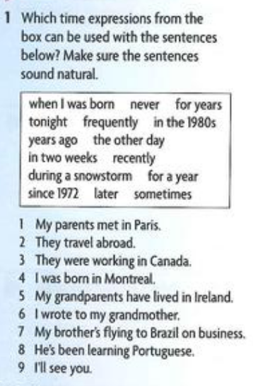
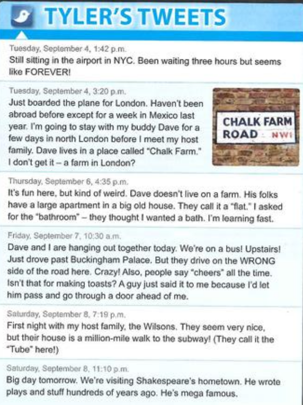

# Auxilary Verbs
Here we have be, do and have. (Used to help the main verb, making and emphasis or a question)
1. In tag questions
   - it's cool today, isn't it?

2. In short answers
   - "Do you like kpap?" "Yes, i do"

3. In reply questions. Are used to show that listener is paying attenrion and is interested.
   - "I've bought you a present" "Have you? How nice"

# Full verbs
Full verbs are all the rest of the verbs left that mean an action (mainly). We can also have _do_, _be_ and _have_ as full verbs ando not auxiliaries (used when we want to emphasize the action)
- I **dont (auxiliar) do (full verb)** excercise
- They **'re(aux) having(full verb)** an argument
- Have (aux) you **been (full verb)** to school today?

# Modal axuliaries verbs
The _help_ other verbs. They are different from be, do and have because they have their own meaning. They are used to show how certain the speaker is about the action.
- You **must** try harder
- **Can** you swim?
- I **can** speak english

# English tense usage
English tenses have two elements of meaning:
Time and Aspect

## Time
1. The time reffered to is usual obvius from the context
   - English people **eat** a lot of fish (all the time)
   - I **'ll see** you later (future)

2. Sometimes a present tense form can refer to the future.
   - I'm going out tonight
   - The train leveas at 10:30 tomorrow

3. Sometimes a past tense form can refer to the present in meaning.
   - I wish i **could** help you, but i can't

# Simple aspect 

1. Describes on action or fact that is seen to be complete or permanent, often an action or event that happens repeatedly and consistently.
   - the sun **rises** in the east
   - she **has** red hair

2. The verbs that rarely use the coninuous aspect express states that are seen to be permanent and not subject to frequent change.

   - Verbs of the mind: know, undestand, believe, think, mean
   - Verbs of emotions: love, hate, like, prefer, care
   - Verbs of possession: have, own, belong, possess
   - Certain other verbs: cost, need, contain, depend

3. Expresses a completed action
   - She **read** fice books while she was on vacation

# Continuous aspect
1. Expresses the ongoing nature of an activity
   - i **'m staying** with my friends until i fing an apartment
2. The activity may not be complete
   - Who **'s been drinking** my chai latte?
3. The actions of some verbs, by definition, lasts a long time, for example, live, work, play. The continuous gives these `actions limited duration and makes them temporary.
   - Sergio **is living** in Seattle while he **is working** on his new book
4. Thee action of some verbs lasta short time **(lose, break, crash)** they are often found in the simple aspect.
   - She **'s cut** her finger 
   - He **hit** me
In the continuous the action of these verbs seems longer or habitual.
   - I **'ve been cutting** the grass
   - He **was hitting** me 

# Perfect aspect
1. The action is completed before another time
   - **Have** you ever **been** to the USA?
   - When i arrived, Peter **had left**
2. The exact time of the verb action is not important. The perfect aspect refers to indefinite time.
   - **Have** you **seen** my wallet anywhere? I've lost it
The exception is the Past Perfect, which can refer to a definite time.
   - She **had visited** her Japanese relatives once in 1993 before she moved in whit them in 1996.

# Passive voice
Passive voice formula | Example | How to identify
--- | --- | ---
Object + be verb + past participle + by + subject (optional) | **Present:**   The cake is being eaten by the dog   **Past:**   The cake was eaten by the dog   **Future:**   The cake will be eaten by the dog | The subject of your sentence is being acted upon by the verb.   The sentence does not clearly state who or what is performing the action.   The word "by" is used to indicate who or what is performing the action.

# Exercises
Rewrite the senteces by changing by changing the active into the passive or vice versa
1. Shakespeare wrote Romeo and Juliet
   - _Romeo and Juliet was written by Shakespeare_
2. The telephone was invented by Alexander Graham Bell
   - _Alexander Graham Bell invented the telephone_
3. The Statue of Liberty was given to the USA by France
   - _France gave the Statue of Liberty to the USA_
4. Two sisters wrote "The Happy Birthda" song in 1893
   - _"The Happy Birthday" song was written by two sisters in 1893_
5. Ada Lovalance wrote the first ever computer code in 1843
   - _The first ever computer code was written by Ada Lovalance in 1843_
6. The arabs introduced pasta to Italy
   - _Pasta was introduced to Italy by the arabs_

# Book Exercises
## Exercise 1

- My parents met in paris **in the 1980s**
- **the other day** They travel abroad 
- They were **recently** working in Canada 
- I was born in Montreal **during a snowstorm** 
- **For a year** My grandparents have lived in Ireland
- I **never** wrote to my grandmother 
- My bothers flying **tonight** to brazil on business
- Hes been learning Portuguese **for years**
- I'll see you **in two weeks**

## Exercise 2

Is the style formal or informal?
- Informal

Wheres is tyler from?
- NYC (New York City)

What does he found strange in London?
- The vocabulary, the buses, etc.

## Exercise 3
1. Where is Tyler spending the year? 
   - In london

2. Is this his first trip abroad 
   - no, it isnt. He travel abroad once before. Last year he went to Mexico

3. Where does Dave live?
   - In north london

4. How long does Tyler plan to stay with Dave?
   - A few days

5. Why did the guy say cheers to Tyler?
   - Because he let him pass

6. Does he like his host family?
   - Yes, he does. He think they're really nice

7. What are they doing on sunday?
   - They go to shakepeare's hometown

## Practice 1
1. Complete the tense charts. Use the verb work for the active and make for the passive

Active | Simple | Continuous 
---|---|---|
Present   Past   Future   Present Perfect   Past Perfect   Future Perfect | He works   She worked   They will work   We have worked   I had ave worked   they will have have worked | we are working   i was working   you will be working   She has been working   you had been working   He will have been working

Passive | Simple | Continuous 
---|---|---|
Present | They are made | It is being made
Past | it was made | it was being made
Future | they will be made
Present perfect | They have been made
Past perfect | It had been made
Future Perfect | They will have been made

### Discussing grammar
Compare the meaning in the pairs of the sentence. Which tenses are used? Why? Discuss your answer with a partner
1. Diego **comes** from Mexico (**_Simple present_**)
   1. Diego is coming from mexico (**_present continuous_**)
2. What were you doing when the accident happend? (**_past continuos_**)
   1. What did you do when the accident happend? (**_simple past_**)
3. I've lived in singapore for five years (**_present perfect_**)
   1. i lived in singapore fro five years (**_simple past_**)
4. When we arrived, he cleaned the apartment (**_simple past_**)
   1. When we arrived, he'd cleaned the apartment  (**_past perfect_**)
5. We'll have dinner at 8:00 right? (**_future simple_**)
   1. Dont call at 8:00. We'll be having dinner (**_future continuos_**)
6. I didnt teach english very well (**_simple past_**)
   1. i wasnt taught english very well (**_simple passive_**)
7. How much are you payin to paint the house? (**_present contunous_**)
   1. How much are you being paid to paint the house? (**_present coninous passive_**)
8. Youre very kind. Thank you (**_Simple present_**)
   1. You're being very kind. What do you want? (**_present continous_**)

