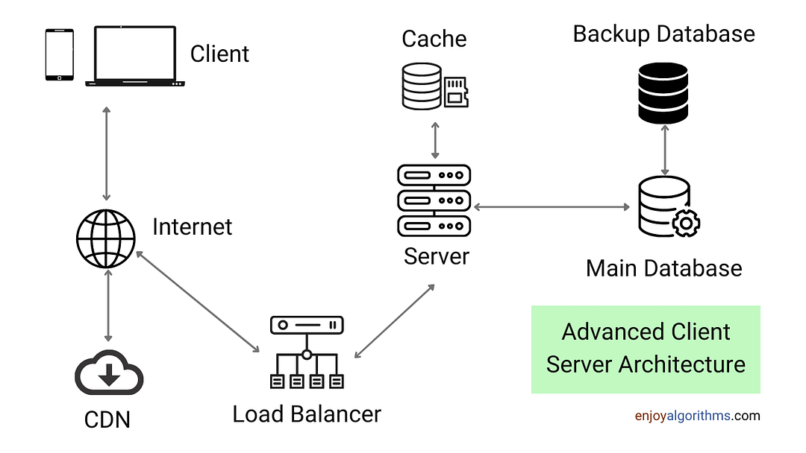

## Objetivo

El alumno configurara entornos de trabajo para desarrollar web.

## Temas

1. Introduccion a la Programacion Web
2. Configuracion de Servidores de Desarrollo Web
3. Configuracion de Servidores de Produccion

## Modelo Cliente-servidor

Estructura distribuida que divide tareas (o cargas de trabajo) entre proveedores de recursos o servicios (servidores) y los que solicitan los servicios (clientes)

## Internet

Conjunto descentralizado de redes de comunicacion interconectadas utilizan las familias de protocolos TCP/IP.

Es la red de redes, es decir, una red que no solo interconecta computadoras sino que tambien interconecta redes de computadoreas entre si.

### Origenes del Internet

El origen de internet data desde 1969 con la primera interconexion de computadoras conocida como Arpanet, entre tres universidades en Carolina (USA).

### Importancia del internet

A supuesto una revoluccion sin precedentes en el mundo de la informatica y de las comunicaciones.

Oportunidad de difusion mundialm un mecanismo de propagacion de la informacion y un medio de colaboracion e interaccion entre individuos y los ordenadores independientes de su localidad geografica.

## Que es la intranet
Red informatica que hace uso de la tecnologia del protocolo de internet para compartir informacion, sistemas operativos o servicios computacionales dentro de una organizacion

## Dominio de internet
Red de identificacion asociada a un frupo de dispositivos o equipos conectados a la red de Internet.

El proposito principal de los nombres de dominio en Internet y el sistema de nombres de dominio (DNS), es traducir las direcciones IP de cada nodo activo en la red a terminos momorizables y faciles de encontrar.

## World Wide Web
Sistema de distribucion de documentos de hipertexto o hipermedios interconectados y accesibles via internet

Desarrollado enre marzo de 1989 y 1990 por Tim Berners-Lee en el CERN en Ginebra, Suiza.

## Hypertext Transfer Protocol | HTTP

Protocolo de Transferencia de Hipertexto.

Protocolo de capa de aplicacion para la transmision de documentos de hipermedia (como HTML).

Diseñado para la comunicacion entre navegadores y servidores web, pero es de proposito general.

Sigue el modelo cliente-servidor.

Utiliza el puerto 80.

### Hypertext Transfer Protocol Secure | HTTPS
Version segura del protocolo HTTP que utiliza el protocolo SSL/TLS para cifrado.

Agrega cifrado, autenticacion e integridad al protocolo 

Utiliza el puerto 443.

## File Transfer Protocol | FTP
Protocolo de transferencia de archivos.

Es un protocolo usado en la capa de aplicacion

Es inseguro porque no esta cifrado.

Su version segura | cifrada es FTPS.

Los puertos que utiliza son:
- Puerto 21: para el control de la conexión (comandos).
- Puerto 20: para la transferencia de datos en modo activo.

## TCP/IP
Grupo de protocolos de red que haven posible la transferencia de datos en redes entre equipos informaticos e internet.